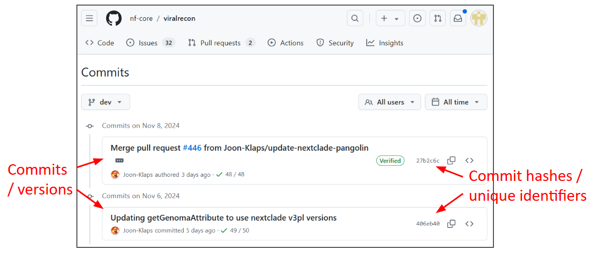

> ### Introduction to the lesson
> This tutorial provides a brief but hands-on introduction to Git and GitHub to demonstrate useful ways of working within GitHub. Git is a version control system which allows files and data to be tracked synchronized, which allows collaboration and reproducibility. GitHub is a popular website that stores these repositories.
>
> **This tutorial avoids using the command line.** Instead, we will practice collaborating and sharing using either the GitHub website or GitHub Desktop application. Why? Because for many cases, it is enough. Especially if you are contributing to existing non-code projects, this may be the fastest, easiest way to do it. Git and GitHub provide collaboration tools to all kinds of projects, and there are all kinds of good ways to use it.
>
> This serves as an introduction to version control using Git and GitHub. After this lesson, you will be able to use git through GitHub Desktop, and might be inspired to take a course on how to use command-line Git such as [CodeRefinery’s git-intro course](https://coderefinery.github.io/git-intro/).
>
> What we will not cover
> * Command line interface
> * Cloning using SSH protocol and SSH keys
> * Rebasing and squashing
> * Many Git tricks which can be explored later
{: .callout}

> ## Why GitHub?
>
> We will do this exercise on [GitHub](https://github.com) but also [GitLab](https://gitlab.com) and [Bitbucket](https://bitbucket.org) allow similar ways of working and basically everything that we will discuss is transferable. With this material and these exercises we do not endorse the company GitHub. We have chosen to demonstrate a number of concepts using examples with GitHub because it is currently the most popular web platform for hosting Git repositories and the chance is high that you will interact with GitHub-based repositories even if you choose to host your Git repository on another platform.
>
> We also encourage course participants to use CodeRefinery’s [Nordic research software repository platform](https://source.coderefinery.org),
> for more information see [https://coderefinery.org/repository/](https://coderefinery.org/repository/).
{: .solution}

## Introduction to Version Control
When making **changes** to files and their content, we risk losing previous content or entire files by overwriting them, hoping they will not be needed. 

Additionally, there may be unintended side effects, such as breaking analysis pipelines when **renaming** files. It can also be challenging to manage multiple changes across different files as a cohesive unit, such as updating a figure and its accompanying description. 

Furthermore, when **collaborating** with others, it is necessary to coordinate and resolve conflicts arising from concurrent changes made by collaborators.

Addressing these issues by **tracking changes** is called **version control**.

### Why are versions valuable? Reproducibility!

**In research**, it is vital to keep track of changes made to data, documentation and software made by you or your collaborators. This allows you to easily reference or retrieve a specific version of the entire project, which promotes reproducibility. 

This becomes especially important during various stages of the research process, such as leading up to publication, addressing reviewer comments, and providing information to reviewers, editors, and readers. Keeping a record of changes made ensures that the research findings can be validated, collaborated upon, and documented accurately, enhancing the reliability and transparency of the research work.

The main benefits are:
- Track history of changes, **who** changed **what** and **when**.
- We can always go back if we make a mistake.
- We have the means to refer to a well-defined version of a project when sharing, collaborating, and publishing.
- If we discover a problem, we can find out when it was introduced.
- Access to the same files from different computers

### When use Version Control?

Basically all work you do where tracking changes is useful:
- Software (this is how it started but Git/GitHub can track a lot more)
- Scripts
- Documents
- Configuration files
- Website sources
- Data

> ### How Version Control Systems Work
> 
> Version control systems (VCS) are software tools that help manage changes to files and documents over time. 
> They work by keeping track of different versions of a file, allowing users to switch between different versions and merge changes made by multiple users.
> 
> 1. VCS maintain a repository that stores all versions of files, along with metadata such as the author, timestamp, and a unique identifier for each version.
> 2. When a user makes changes to a file, the VCS creates a new version, rather than overwriting the existing one. 
> This preserves the history of changes made to the file.
> 3. VCS provide features like branching and merging, which allow users to create separate lines of development (branches) for different tasks or features, 
> and then merge them back into the main branch when they are ready.
> 4. VCS also enable users to compare different versions of a file, track changes made by different users, and revert to previous versions if needed.
> 5. VCS facilitate collaboration among multiple users by providing mechanisms for resolving conflicts that may arise when two or more users make changes to the same file simultaneously.
>
> Overall, VCS provide a systematic and organized approach to managing changes to files, 
> enabling efficient collaboration, and preserving the history of changes made to a project. 
{: .callout}

### Version Control Systems vs. Manual Versioning

To highlight some benefits of version control systems over manual version control:

* Instead of mandating users to create backups of the entire project, version control systems securely stores only the necessary information to **recreate previous versions** of files on demand.

* Instead of depending on users to come up with meaningful names for backup copies, the version control system automatically **timestamps** all saved changes, ensuring efficient tracking and organization of revisions.

* Instead of requiring users to consistently update a changelog, version control systems prompt users to document changes every time a modification is saved. They also keep a 100% **accurate record** of what was *actually* changed, as opposed to what the user *thought* they changed. This can be immensely valuable for troubleshooting and issue resolution when problems crop up later.

* Instead of blindly copying files to remote storage, version control systems perform **conflict checks** to ensure that no one's work will be overwritten. If conflicts are detected, they are identified, making it easier to resolve and merge changes.

## Version control with [Git](https://git-scm.com) and [GitHub](https://github.com) and [GitHub Desktop](https://github.com/apps/desktop)

To put it simply, **Git** is a version control **system** and a program that you install on your computer, like Word, which helps you keep track of changes in files. It acts like a virtual folder called a repository where all changes are stored as versions, also known as commits.

On the other hand, **GitHub** is a **web-based** hosting service for Git repositories. It provides a platform for collaborative work, where you can store and manage your Git repositories online. GitHub acts as a remote repository that can communicate with your local Git repository. Just like OneDrive can synchronize Word documents across multiple devices, GitHub can propagate changes made in Git repositories across different computers and provide a centralized location for collaboration and version control in a group setting.

**GitHub Desktop** is an app, which runs locally on your computer, that provides a graphical user interface to Git and GitHub. Using it, you don't have to write commands in order to communicate changes between the remote GitHub repository and your local Git repository. There are other tools that can do this too (e.g. [Sourcetree](https://www.sourcetreeapp.com/)).

## A bit of terminology
<!-- could make use of some pictures -->
The first term we need to know when using git is a **repository**: 
  * This is a collection of files in a folder or directory related to your project, in which you create and save new code or content. It can be located remotely on GitHub or locally on your computer. It contains the changelog of your project with commits, branches, tags etc.
* A repository can be **private** only to you and your collaborators, or set to be **public**, i.e. open for the world:
  * If you know that the repository you create is for your own purpose only, or you know that there might be content that is ‘sensitive’, you set it as Private.
  * However, if this repository is going to be shared with the world, set it as Public. 
  * A repository doesn’t need to be public in order to collaborate. Collaborators can be added to a private repository as well.

Changes made to files in your repository is saved and tracked in real-time, You don’t save copies of your document, you just save the the life story of the document, or its timeline. This timeline is also called a **branch**: 

* The default branch is called “main” (or sometimes “master”) but you can create additional branches in the repository in order to have different versions of a repository at one time within the same repository. 
* Branches allow you to work on different parts of a project in parallell without impacting the main branch. When the work is complete, a branch can be integrated with the main project via a merge and a pull request.
* You can even switch between branches and work on different projects without them interfering with each other.
* Branching is helpful when you want to add new features to a project without changing the main source of code. The work done on different branches will not show up on the main branch until you merge it, which we will cover later in this guide. You can use branches to experiment and make edits before committing them to main.

Each saved change in the repository is called a **commit**:
  * Each commit has a unique identifier but it also comes with a commit message describing what has been changed, ie “Add references for chapter 05”. 
  * This is important to be able to find the correct time-point if you want to go back and undo changes/revert to a previous version later. 

In addition, to make it easier to keep track of which version is used for what purpose, we can use **tags** in GitHub:
* A tag is like a sticky note that you attach to a particular commit (e.g. phd-printed or paper-submitted)

> ### Glossary for Git & GitHub
> 
> - **branch**: A copy of a repository that is contained within the original repository. Branches are used to work on different project features without altering the original (often called `main` or `master`) repository.
> - **cloning**: Copying the whole repository to your laptop - the first time. It is not necessary to download each file one by one.
> - **commit**: A saved change / version of the project, gets a unique identifier / commit hash (e.g. `c7f0e8bfc718be04525847fc7ac237f470add76e`).
> - **forking**: Taking a copy of a repository (which is typically not yours) - your
>   copy (fork) stays on GitHub and you can make changes to your copy.
> - **merge**: The act of incorporating new changes (commits) from one branch to another.
> - **pull request (PR)**: A request to add a commit or a collection of commits to a repository.
> - **repository**: A collection of documents related to your project, contains all data and history (commits, branches, tags).
> - **tag**: A pointer to one commit, to be able to refer to it later. Like a sticky note that you attach to a particular commit (e.g. `phd-printed` or `paper-submitted`).
{: .callout}

## Navigating the GitHub web interface

Login to [GitHub](https://github.com/) and briefly explore the [nf-core/viralrecon](https://github.com/nf-core/viralrecon/) repository. Try out changing branch from `master` to `dev`.

Click on the **commits** of 
[viralrecon-commits-dev](https://github.com/nf-core/viralrecon/commits/dev)
repository.  This lists all commits (versions) of the development branch, with commit hashes (unique identifiers).

### Interesting repositories to explore these concepts
- Assembly and intrahost/low-frequency variant calling for viral samples
  - Repository: <https://github.com/nf-core/viralrecon/>
  - Commits, branches, forks: <https://github.com/nf-core/viralrecon//network>
- Swedish pathogens portal
  - Repository: <https://github.com/ScilifelabDataCentre/pathogens-portal>
  - Commits, branches, forks: <https://github.com/ScilifelabDataCentre/pathogens-portal/network>
- [Activity inequality study](http://activityinequality.stanford.edu/)
  - Contains data and code necessary to create figures from their article.
  - Data: <https://github.com/timalthoff/activityinequality/tree/master/data>
- FiveThirtyEight story [Why We’re Sharing 3 Million Russian Troll Tweets](https://fivethirtyeight.com/features/why-were-sharing-3-million-russian-troll-tweets/)
  - Contains data and readme file, no code.
  - Data: <https://github.com/fivethirtyeight/russian-troll-tweets>
- CSV exports of the Getty Provenance Index
  - Data: <https://github.com/thegetty/provenance-index-csv>
- Entire books are written using Git/GitHub:
  - <https://github.com/rust-lang/book>
  - <https://github.com/ropensci/dev_guide>
  - <https://github.com/the-turing-way/the-turing-way>
- Papers under open review:
  - <https://github.com/openjournals/joss-reviews/issues>

---
> ## Excersice 1: Quiz
> Which of the following statements are correct concerning version control?
>  1. Version control serves as a backup system.
>  1. Version control systems makes it easier to collaborate when working with the same file.
>  1. Using a version control system, I don't have to wonder which version of the manuscript was sent to publisher.  
>  1. Git is exclusively designed for managing software development and cannot track changes in other types of files like documents or data.
>  1. GitHub Desktop is a version control system.
>  1. Cloning a repository in GitHub copies the repository to your local machine, while forking creates a copy of someone else's repository to your personal account on the GitHub server.
>
>> ## Solution
>>
>> 1. No, version control keeps track of different versions, but your work still needs to be backed up. Relying on only the remote repository at GitHub, does not comply with the 3-2-1 backup rule of having at least 3 copies, on 2 different types of digital media, and at least 1 separate location.
>> 1. Yes, collaborations, and resolution of conflicts when editing the same file, is much easier with a version control system.
>> 1. Well no, all versions are safely kept, but unless you put a (name) tag on a specific version, the system will not be able to help you on which version was sent to publisher.
>> 1. No, Git started out as a software versioning control system, but can track a lot of other types of data as well.
>> 1. No, GitHub Desktop is an app that provides a graphical user interface to the version control system Git, by communicating with the web service GitHub.
>> 1. Yes, the fork can then be cloned to your local machine, and changes done will not affect the original (someone else's) repository, only your copy of it.
> {: .solution}
{: .challenge}