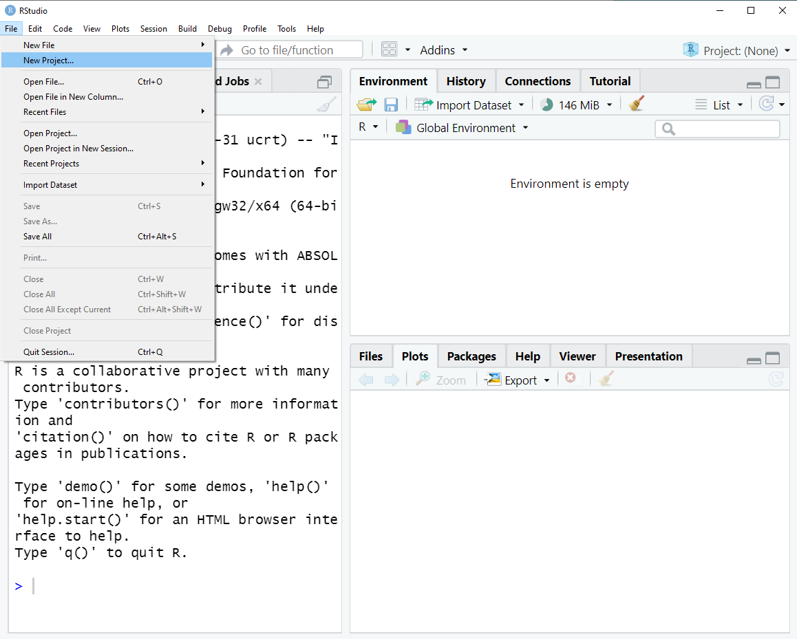
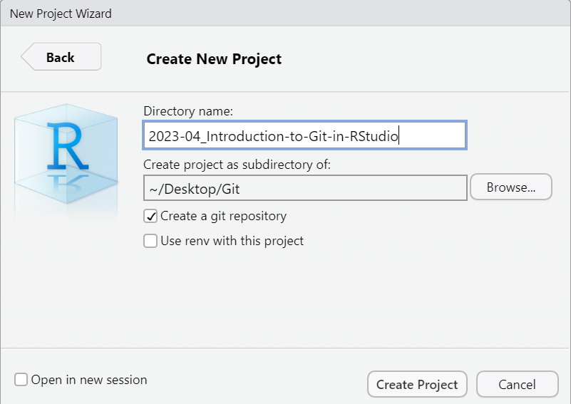
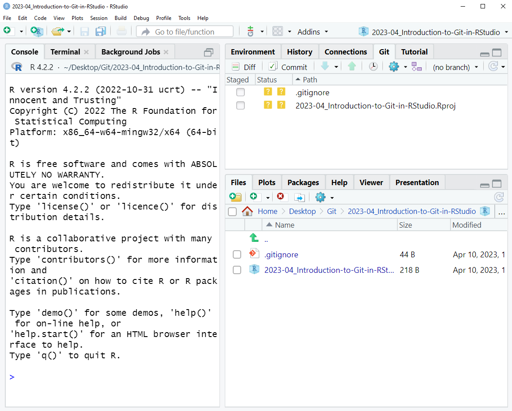
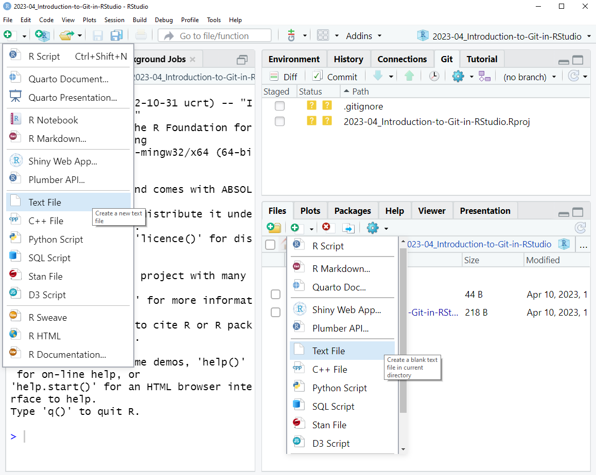
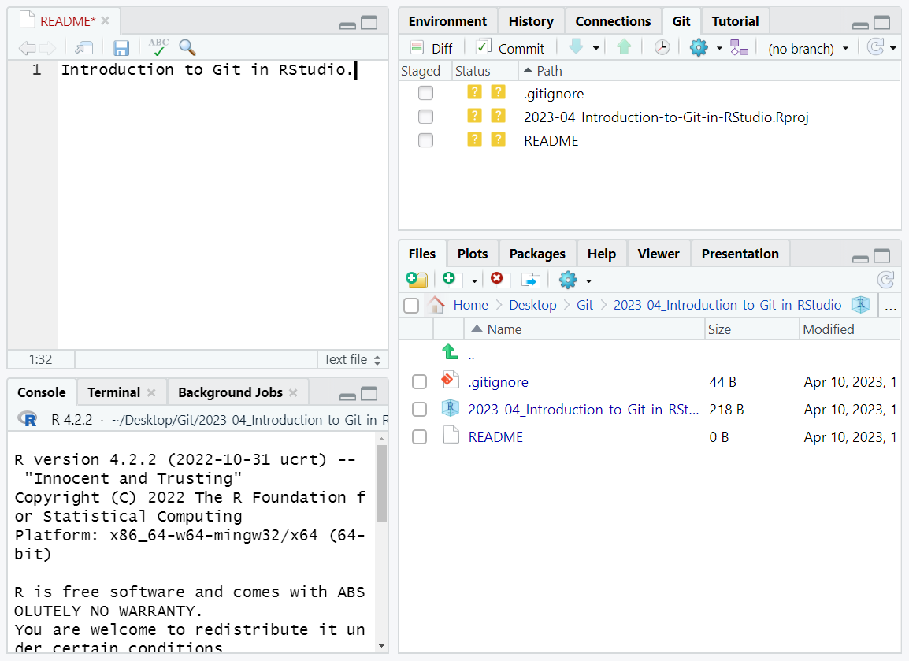
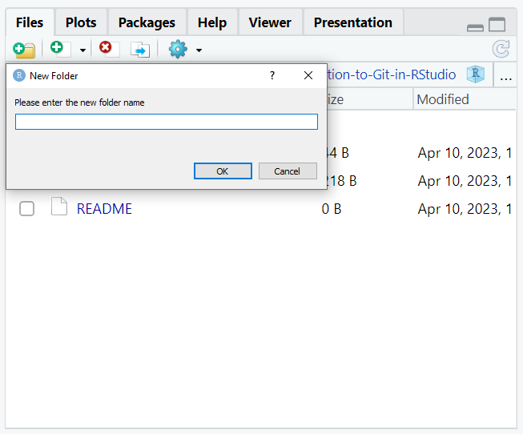
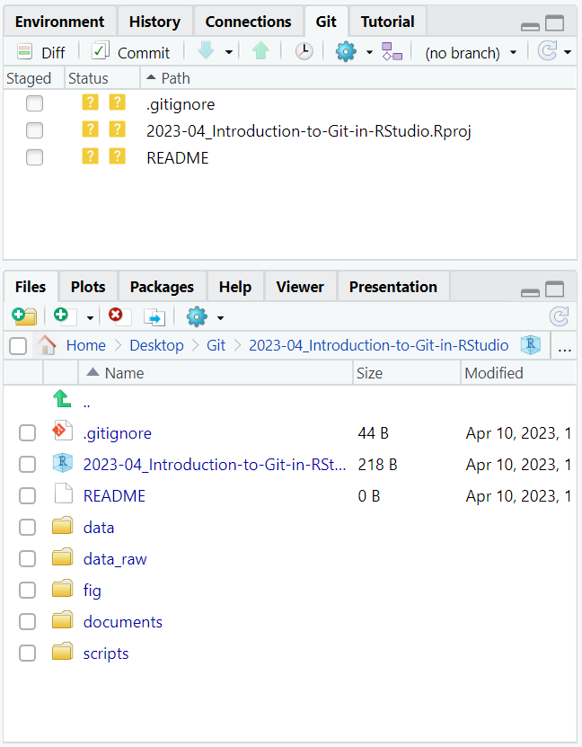
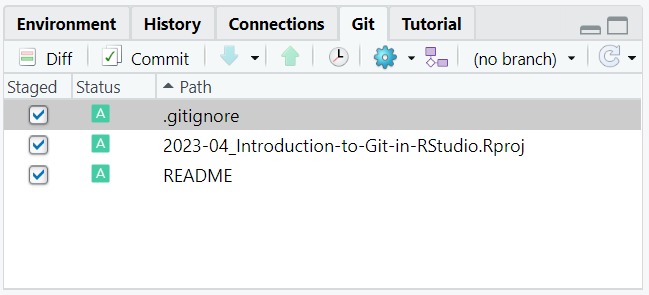
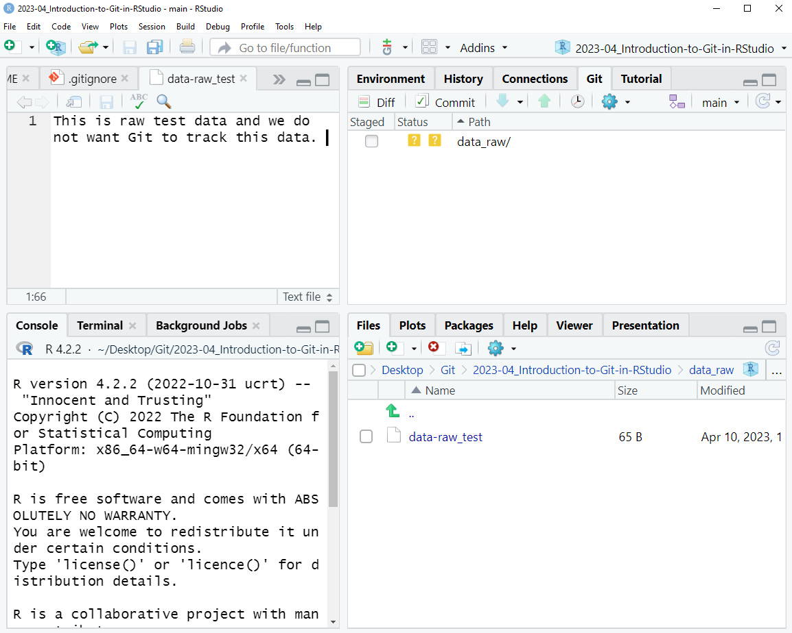
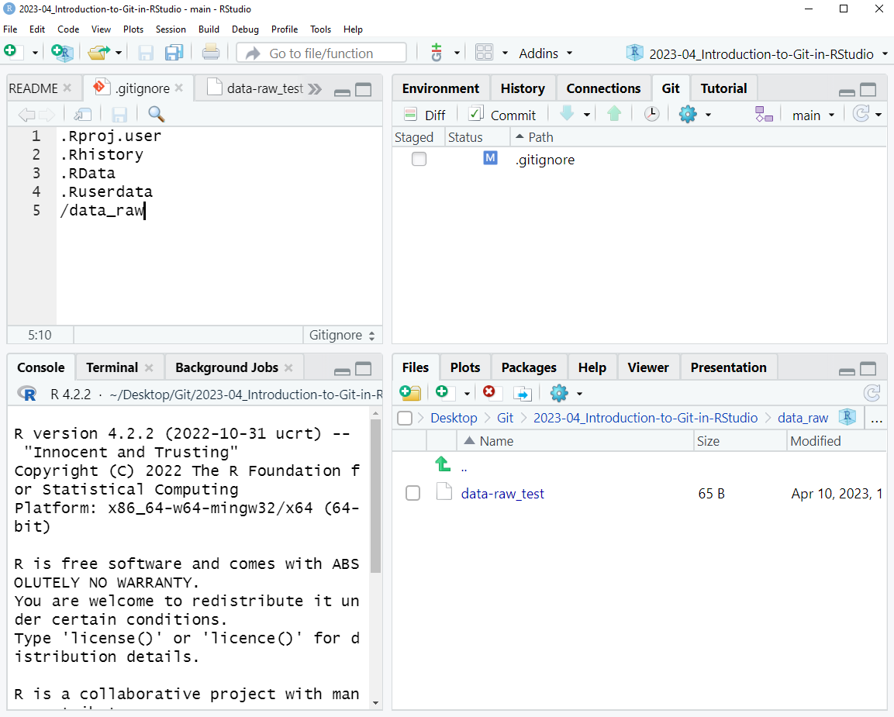

> ### About this episode 
> Using Git for version control can be highly beneficial when developing data analysis scripts. 
> To support this, RStudio has integrated Git into its interface. 
> Although some advanced Git functionalities still require the command-line, RStudio provides a user-friendly interface for many common Git operations. For the more excelled Git users, RStudio also provides an integrated terminal window. This makes RStudio a great multifunctioning tool for both data management and data analysis scripting. 
> 
> In small groups it can be useful to do this side by side (in-person) or one
> learner shares their screen (video) and others can ask questions and give
> suggestions. In a larger group the instructor can demonstrate these and then
> participants can try on their own and then ask questions.
{: .callout}

### Step 1: Create a new project

How to use Git in RStudio? Create a new project and you will see a dialog box where you can choose how to create the project. Click on "File" and "New Project...".

You get three alternatives and here is a short summation:

- **New Directory:** if you start from the beginning, no previous folders or files.
- **Existing Directory:** if you already have an ongoing project on your computer, but it is not yet an R project.
- **Version Control:** if you have a repository on the web and want to connect it with your computer.

We will start with a "New Directory". Choose "New Project". Fill in the name of your directory and choose a convenient location for it (e.g., `YYYY-MM_Introduction-to-Git-and-RStudio`). Check the box "Create a git repository".

### Step 2: Set up the new project

It is good practice to create a README text file at the top level of your working directory to provide the context of the files in the directory. Making this a habit can save you many hours of work, as it will allow you to quickly get into a project again after being away from it for some time. You may also find a README file helpful when you collaborate with others around a bunch of files.

- Create a README file (.txt), fill it in and save it.
- Create new folder: `data`, `data_raw`, `documents`, `fig`, `scripts`.
- Inspect the git status.

### Step 3: Commit the new files

Now, we add the new files to the staging area and make our first commit to our git repository.

- Tick the boxes under "Staged". Note how the status changes from "??", which stands for "not tracked", to "A" which stands for "Add".
- Go to commit and fill in the commit message.
- Confirm the commit.

We have now completed our first snapshot of the project! Try to commit the process of your project in smaller chunks. Generally, it is better to commit once a day instead of once a week. If you do a lot of work daily, it is wise to commit more than once a day.

### Step 4: Modify .gitignore

The `.gitignore` file is used to tell git which files we do not want to track.

- Go to the folder data_raw/ and add a data file of your choice. Modify the file and save it.
- Note how the status changes. Why does the status not change for the other folders?
- Open the .gitignore and add `data_raw/`.
- Note how the status changes. "M" stands for modified.
- Stage the changes and commit the new changes to the git repository.

---

> ## Summary
>
> RStudio's integration with Git allows users of all levels to easily start versioning their important work locally, without having to leave the RStudio environment. Once the local repository is established, it can be linked to a website such as GitHub, facilitating collaboration with others. It is also possible to clone (download a copy) of a remote repository to your computer, but more of that later!
>
> Next up is the tutorial on how to create a repository on GitHub.com. Thereafter, we will show how to connect the remote repository with our local repository.
{: .callout}
