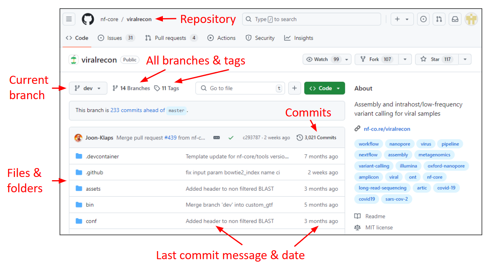
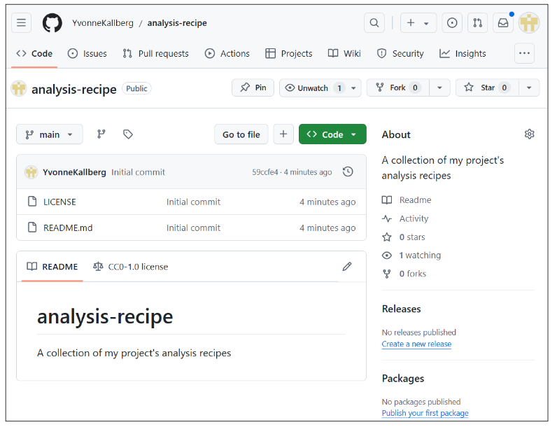
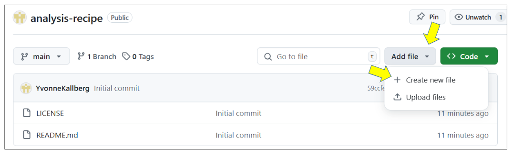
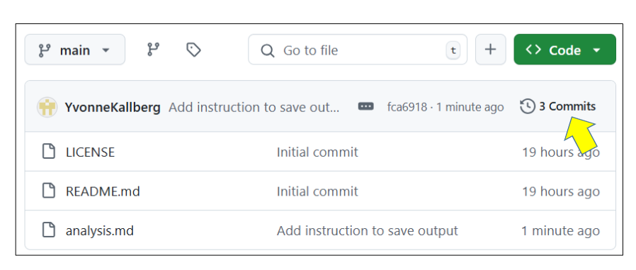
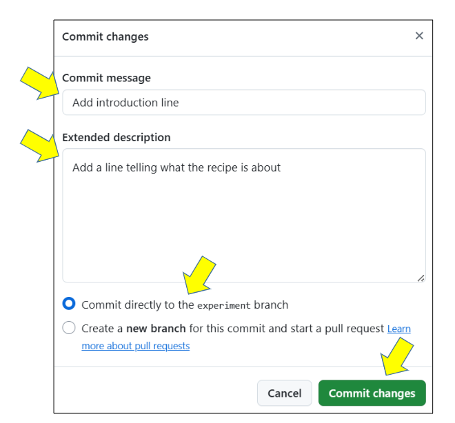
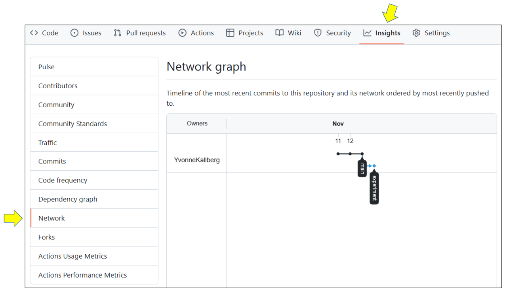
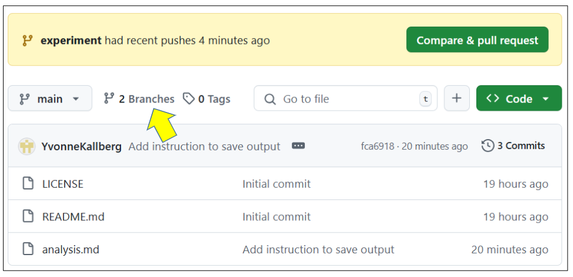

> ### About this episode 
> We will practice creating a new repository using the web interface, committing changes to it, browsing the changes, creating branches, and more. This is everything you need to do basic file management, though you'll probably want something faster to use.  Still, it can be good for quick edits and contributions.
>
> In smaller groups it can be useful to do this side by side (in-person) or one learner shares their screen (video) and others can ask questions and give suggestions. In a larger group the instructor can demonstrate these and then participants can try on their own and then ask questions.
{: .callout}

## Navigating the GitHub interface
Login to [GitHub](https://github.com/) and briefly explore the [viralrecon](https://github.com/nf-core/viralrecon/commits/master) repository.

> ### Terms and defintions for Git & GitHub
> 
> - **repository**: The project, contains all data and history (commits, branches, tags).
> - **commit**: Snapshot of the project, gets a unique identifier (e.g. `c7f0e8bfc718be04525847fc7ac237f470add76e`).
> - **branch**: Independent development line, often we call the main development line `main`.
> - **tag**: A pointer to one commit, to be able to refer to it later. Like a sticky note that you attach to a particular commit (e.g. `phd-printed` or `paper-submitted`).
> - **cloning**: Copying the whole repository to your laptop - the first time. It is not necessary to download each file one by one.
> - **forking**: Taking a copy of a repository (which is typically not yours) - your
>   copy (fork) stays on GitHub and you can make changes to your copy.
{: .callout}



GitHub file view of the
[nf-core/viralrecon](https://github.com/nf-core/viralrecon/)
repository.  This is the version of all files at a single point in
time.


Github history view of the
[viralrecon](https://github.com/nf-core/viralrecon/commits/master)
repository.  This is the progression of the repository (with the
**commit message** over time).


Network graph of all commits in the
[nf-core/viralrecon](https://github.com/nf-core/viralrecon/network)
repository.  This shows the relationship between different **forks**
of people who are contributing and sharing code.

> ### Interesting repositories to explore
> 
> - Assembly and intrahost/low-frequency variant calling for viral samples
>   - Repository: <https://github.com/nf-core/viralrecon/>
>   - Commits, branches, forks: <https://github.com/nf-core/viralrecon//network>
> - Swedish COVID-19 data portal
>   - Repository: <https://github.com/ScilifelabDataCentre/covid-portal>
>   - Commits, branches, forks: <https://github.com/ScilifelabDataCentre/covid-portal/network>
> - [Activity inequality study](http://activityinequality.stanford.edu/)
>   - Contains data and code necessary to create figures from their article.
>   - Data: <https://github.com/timalthoff/activityinequality/tree/master/data>
> - FiveThirtyEight story [Why We’re Sharing 3 Million Russian Troll Tweets](https://fivethirtyeight.com/features/why-were-sharing-3-million-russian-troll-tweets/)
>   - Contains data and readme file, no code.
>   - Data: <https://github.com/fivethirtyeight/russian-troll-tweets>
> - The NY Times Coronavirus (Covid-19) Data in the United States
>   - Contains data, readme, license, but no code.  As of 2020 April,
>     being updated every day.
>   - Data: <https://github.com/nytimes/covid-19-data>
>   - Website: <https://www.nytimes.com/interactive/2020/us/coronavirus-us-cases.html>
> - CSV exports of the Getty Provenance Index
>   - Data: <https://github.com/thegetty/provenance-index-csv>
> - Entire books are written using Git/GitHub:
>   - <https://github.com/rust-lang/book>
>   - <https://github.com/ropensci/dev_guide>
>   - <https://github.com/alan-turing-institute/the-turing-way>
> - Papers under open review:
>   - <https://github.com/openjournals/joss-reviews/issues>
{: .solution}

## Step 1: Create a repository with a README and a license

You start off by creating a repository on the web.  In fact, we
usually end up doing this on the web, no matter how you do your daily
work.  The important questions are who is the *owner* and what is the
*name* of the repository.

Make sure that you are **logged into GitHub**.

To create a repository we either click the green button "New" (top left corner):


---

Or if you see your profile page, there is a "+" menu (top right corner):


---

Yet another way to create a new repository is to visit
[https://github.com/new](https://github.com/new) directly.

---

We then land at the following form.  Please fill it out and set **Initialize
this repository with a README** and choose a license.  If you don't find a
suitable license, we will show later how you can add your own.


---

And now we have a repository with a README and LICENSE and one commit:



---

## Step 2: Create a new file

We can easily add new files from the web interface.

Create a file, e.g. `analysis.md` (the "md" ending signals that this is in Markdown format):


In the new file you can share a recipe – for example the necessary steps to run an analysis (or cooking or something else).
You can also copy-paste this as a starting point:
```
Input files:
- samples_openrefine_lesson.csv -- the messy dataset from the OpenRefine lesson 
- data_cleaning_script.txt -- the OpenRefine operations you've extracted

Output files:
- samples_openrefine_lesson_clean.csv -- the clean dataset reulting from the OpenRefine lesson

Instructions:
1. Start a new project in OpenRefine using the messy dataset you downloaded before (`samples_openrefine_lesson.csv`). 
2. Give the project a new name.
3. Click the `Undo / Redo` tab > `Apply` and paste in the contents of the data_cleaning_script.txt file you just created with the JSON code.
4. Click `Perform operations`. The dataset should now be the same as your other cleaned dataset.
```


Then add a commit message and commit (save):


> ## Good commit messages
>
> - What has changed is more useful than which file has changed
> - Sometimes we forget to document *why* something was changed
> - Many projects start out as projects "just for me" and end up to be successful projects
>   that are developed by 50 people over decades.
> - Write commit messages in English that will be understood
>   15 years from now by someone else than you.
> - ["My favourite Git commit"](https://fatbusinessman.com/2019/my-favourite-git-commit)
> - ["On commit messages"](https://who-t.blogspot.com/2009/12/on-commit-messages.html)
> - ["How to Write a Git Commit Message"](https://chris.beams.io/posts/git-commit/)
{: .callout}

---

## Step 3: Modify a file

We can also easily modify files from the web.

Now improve the recipe by adding an ingredient or an instruction step:
- Click on the file.
- Click the "pen" icon on top right ("edit this file").

Make an improvement, write a commit message, commit:


Once you have done that, browse your commits:


In my example I got:


---

## Step 4: Create a new branch

A **branch** is a separate line of development. They are useful when
you have multiple things going on at once and you don't want them to
get in the way of each other.  It also allows collaboration, as we
will learn in the next episode.

- Create a new branch:
  
- Modify your recipe on the newly created branch. Make sure you commit to the new branch:
  
- Then switch back to the `main` branch and browse your recipe there. Compare the file on both branches.

---

## Step 5: Repository insights and settings

Github gives us many insights into our repository.  Nothing here is
really specific to Github (everything can be done with regular Git),
but they make it especially easy to see.  The **network** lets you see
how all commits and branches relate.

Have a look at the network, hover over the dots in the graph
(commits).  The network view is the best way to get an overview of
your branches and commits, and it never hurts to come back here and
check:



---

## Step 6: Adding a license to an existing repository

This is an optional step to show how we can add a license
to an existing repository.

- Visit [https://choosealicense.com/](https://choosealicense.com/) and let it guide you.
- If you don't find a suitable license,
  choose among [https://choosealicense.com/appendix/](https://choosealicense.com/appendix/).
- Once you have chosen, click on the license name, and you can enter your GitHub repository URL (top right)
  which will open a pull request (change request) to the repository:


---

## Optional step: How can we merge branches?

This is an optional step which the instructor may demonstrate and discuss:

We made a separate branch, separate from the main branch `main`.
What happens when we decide we like that change, and want to take it
into use?  We will soon see the magic of Git.

First browse to the overview of all branches:


Now to initiate a merge (request), click on "New pull request":


Once a "pull request" (think of it as a change proposal) is open, it can be
reviewed and merged. We will return to "pull requests" when we later discuss
how to contribute changes.

