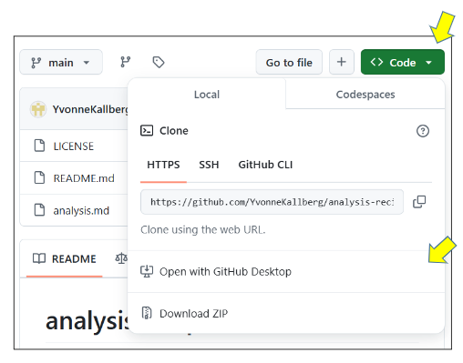
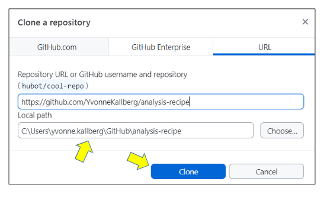
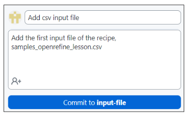
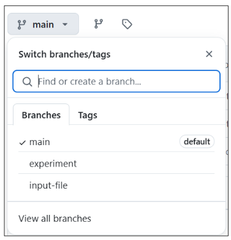
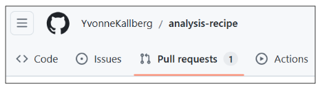
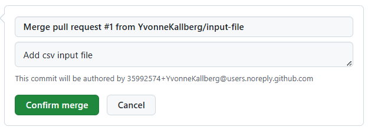
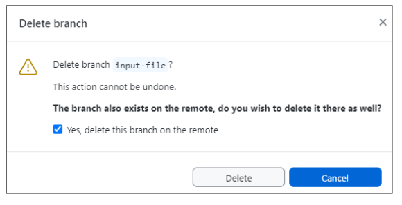
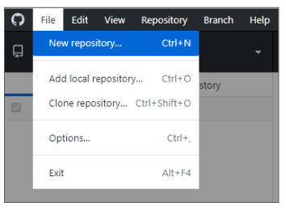
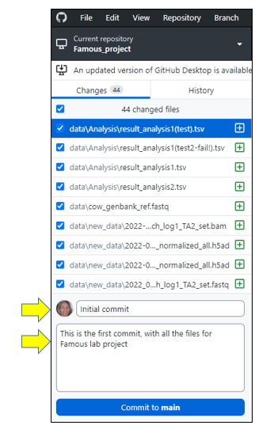
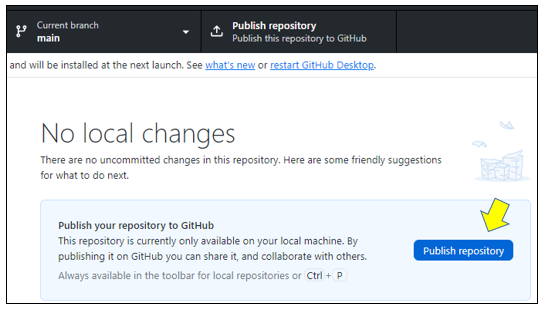

> ### About this episode 
> We will practice creating a new repository using GitHub Desktop, committing changes to it, browsing the changes, creating branches, and more. This is practically the same as the previous episode, but we introduce
> some new concepts:
> 
> - There are now two copies of your repository: that on your computer,
>   and that on GitHub.
> - We introduce the concepts of **pull** and **fetch** to move code
>   GitHub→local, and **push** to move code local→GitHub.
> - **GitHub Desktop** is an application that lets you manage files with
>   Git. It is *not* the only way to use Git, but it is easy and
>   integrated, so it's a nice thing to use.
> - One can share existing projects also using the web interface, so GitHub Desktop
>   is *not* the only way to make an existing project available on GitHub.
> 
> In small groups it can be useful to do this side by side (in-person) or one
> learner shares their screen (video) and others can ask questions and give
> suggestions. In a larger group the instructor can demonstrate these and then
> participants can try on their own and then ask questions.
{: .callout}

## Step 1: Create a clone (copy) of remote repsitory

In this exercise, we will download the repository we created in the previous episode, so that we can work on it locally instead.

Go to your remote GitHub repository via the browser. Click on the green `Code` button and select `Open with GitHub Desktop`.

In GitHub Desktop app, verify that the local path is where you want the repository to be, click on **Clone** in the appearing window:

After GitHub Desktop has created the local copy of the remote repository, we can open it in an external editor, such as Visual Studio Code. 

## Step 2: Create a new branch

In this exercise we will create a new branch to work in.

In GitHub Desktop app, click on Branch in the menu on the top and select New Branch:

Name the branch `input-file` and click on `Create branch`

Notice that the current branch now has changed from **main** to **input-file**.

At the moment, this branch is only in your local repository. In order for it to be seen also remotely, click on **Publish branch**.

## Step 3: Add a file locally

In this exercise we will add the input file(s) mentioned in the analysis recipe, *samples_openrefine_lesson.csv* and *data_cleaning_script.txt* (optional), to our newly created branch. 

First, download the [samples_openrefine_lesson.csv](../data/samples_openrefine_lesson.csv) (right click and 'Save as'), and put it in the folder analysis-recipe (in my case it is in C:\Users\yvonne.kallberg\GitHub\analysis-recipe\).

Go to GitHub Desktop, notice that the file name is there (to the left) with a green plus (meaning that it is a new file), as well as a preview of the file content (to the rigth):

Write a commit message (down to the left) and click on **Commit to input-file**:

In order for the file to appear remotely, we need to **Push**, either by clicking on **Push origin** in the top menu, or by clicking on **Push commits to the origin remote**:

### Optional

Repeat the process for the script file [data_cleaning_script_openrefine_lesson.txt](../data/data_cleaning_script_openrefine_lesson.txt).

## Step 4: Create a pull request
In this exercise, we will do a pull request and merge the branch we have committed the input files to, `input-file`, with the `main` branch.

First let's inspect what we have on the remote repository. Via the browser go to your analysis-recipe repository.

Switch branches between `main` and `input-file`, and notice that the content differs between them (in the branch `input-file` there is a file, `samples_openrefine_lesson.csv`, listed which is not found in the `main` branch):

We *could* do a merge here, via the browser, but let's try another way, using the GitHub Desktop app.

In GitHub Desktop, click on **Preview Pull Request**:

The appearing window let's you know what the intention is, i.e. 'Merge 1 commit into `base: main` from `input-file`, what the changes are (added file samples_openrefine_lesson.csv), and if this will cause any conflicts (answer: 'Able to merge'):

Click on **Create pull request**. This will open a new tab in your browser, in your remote GitHub repository. Click on the green `Create pull request` button.

Notice that you now have a '1' at **Pull requests** in the menu:

Lower down on the page, there is a green button **Merge pull request**, click on that, and then on **Confirm merge**:

The last thing we need to do is some clean up, i.e. to delete the now merged branch 'input-file' since we don't need it anymore. We can delete the branch via the browser, by clicking **Delete branch**:

However, this would only delete the remote branch, not the one we have locally. Instead let's return to the GitHub Desktop app. In the menu at the top, click on **Branch** and select **Delete**. In the window that then shows up, make sure that the branch is **input-file** and click the box `Yes, delete this branch on the remote`. Finally, click Delete:

**Note:** There's no harm in keeping merged branches, especially when they are only a few, but imagine that you have 20 or more branches, then it starts to get messy.
__________

## Extra exercise - starting locally from scratch <!-- or separate episode? -->
Up until now, we have started remotely on GitHub with creating a repository, and then adding content either by staying remotely or working locally via GitHub Desktop. However, imagine the scenario where you already have a file or a folder, and then realise that it would be a good idea to create a GitHub repository, and start with version control.

The following steps can then be performed:
Say that we want start with version control on the folder with the [Famous_project_No-1!.zip](https://nbisweden.github.io/module-organising-data-dm-practices/data/Famous_project_No-1!.zip) from the Data organisation practices module.

At the moment, I have extracted all the files and put the folder on my Desktop (C:\Users\yvonne.kallberg\Desktop\Famous_project_No-1!\).

### Step 1: Create new local repository
First we need to create a new local repository. 
Open GitHub Desktop app, click on **File** in the top menu and select **New repository**.

Fill in the information and click on **Create repository**:

### Step 2: Add the files to local GitHub repository

Next, we need to move the content from our folder on Desktop to our newly created GitHub repository, i.e. the files in `C:\Users\yvonne.kallberg\Desktop\Famous_project_No-1!\` should move to `C:\Users\yvonne.kallberg\GitHub\Famous_project\`. I do this in File Explorer.

### Step 3: Commit the files to local GitHub repository

Now, open GitHub Desktop app. Notice that we now have a whole bunch of new files. Write a commit message and click on `Commit to main`:

### Step 4: Publish the local repository to remote GitHub

So far, we only have the files locally on our computer. Hence, we need to **Publish your repository to GitHub**. Click `Publish repository` either in the top menu or in the main window:

Done! Now you can continue working with this folder in a version controlled manner, creating branches, pushing to and  pulling from remote repository, merging branches etc. 

> ## Summary
>
> With GitHub Desktop, we can do everything we can on the web, but it's
> more integrated. The most important concepts are that of **remotes** <!-- do we need to explain remotes in the introduction?>
> (links between repositories), **pushing**, and **pulling**.
>
> We don't cover it in this workshop, but you can eventually do all of
> these things from the command line, for example `git commit
> some_file.csv`.  Once you are doing many things, this can be faster.
> Still, there's almost always a place for applications like the GitHub Desktop
> and other graphical user interfaces/desktop apps to
> make things smoother.
{: .callout}
