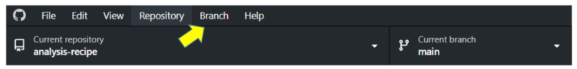
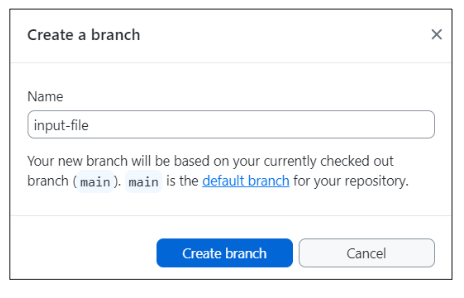

> ### About this episode 
> We will practice creating a new repository using GitHub Desktop, committing changes to it, browsing the changes, creating branches, and more. This is practically the same as the previous episode, but we introduce
> some new concepts:
> 
> - There are now two copies of your repository: that on your computer,
>   and that on Github.
> - We introduce the concepts of **pull** and **fetch** to move code
>   GitHub→local, and **push** to move code local→GitHub.
> - **GitHub Desktop** is an application that lets you manage files with
>   Git. It is *not* the only way to use Git, but it is easy and
>   integrated, so it's a nice thing to use.
> - One can share existing projects also using the web interface, so GitHub Desktop
>   is *not* the only way to make an existing project available on GitHub.
> 
> In small groups it can be useful to do this side by side (in-person) or one
> learner shares their screen (video) and others can ask questions and give
> suggestions. In a larger group the instructor can demonstrate these and then
> participants can try on their own and then ask questions.
{: .callout}

## Step 1: Create a clone (copy) of remote repsitory

In this exercise, we will download the repository we created in previous episode, so that we can work on it locally instead.

Go to your remote GitHub repository via the browser. Click on the green `Code` button and select `Open with GitHub Desktop`.

In GitHub Desktop app, verify that the local path is where you want the repository to be, click on **Clone** in the appearing window:

After GitHub Desktop has created the local copy of the remote repository, we can open it in an external editor, such as Visual Studio Code. <!-- What is shown in GitHub Desktop if there is no Visual Studio available? Should we include requirement of Visual Studio in preparation instructions? Should we open editor via GitHub Desktop or perhaps instruct to open the editor and navigate to the repo folder? -->

<!-- Create a new branch locally, add input file 1, provide link, push to remote, create a pull request, compare what happens in VS when shifting branches (that file one does not exist in 'main' branch, inspect remotely -->

## Step 2: Create a new branch

In this exercise we will create a new branch to work in.

In GitHub Desktop app, click on Branch in the menu on the top and select New Branch.

Name the branch `input-file` and click on `Create branch`

Notice that the current branch now has changed from **main** to **input-file**.

At the moment, this branch is only in your local repository. In order for it to be seen also remotely, click on **Publish branch**.

## Step 3: Add a file locally

In this exercise we will add the input file(s) mentioned in the analysis recipe, *samples_openrefine_lesson.csv* and *data_cleaning_script.txt* (optional), to our newly created branch. 

First, download the [samples_openrefine_lesson.csv](../data/samples_openrefine_lesson.csv) (right click and 'Save as'), and put it in the folder analysis-recipe (in my case it is in C:/Yvonne Kallberg/GitHub/analysis-recipe/).

Go to GitHub Desktop, notice that the file name is there (to the left) with a green plus (meaning that it is a new file), as well as a preview of the file content (to the rigth):

Write a commit message (down to the left) and click on **Commit to input-file**:

In order for the file to appear remotely, we need to **Push**, either by clicking on **Push origin** in the top menu, or by clicking on **Push commits to the origin remote**:

### Optional

Repeat the process for the script file [data_cleaning_script_openrefine_lesson.txt](../data/data_cleaning_script_openrefine_lesson.txt).

## Step 4: Create a pull request
In this exercise, we will do a pull request and merge the branch we have committed the input files to, `input-file`, with the `main` branch.

First let's inspect what we have on the remote repository. Via the browser go to your analysis-recipe repository.

Switch branches between main and input-file, and notice that the content differs between them (in branch input-file there is a file, samples_openrefine_lesson.csv, listed which is not found in main branch):

We *could* do a merge here, via the browser, but let's try another way, using the GitHub Desktop app.

In GitHub Desktop, click on **Preview Pull Request**:

The appearing window let's you know what the intention is, i.e. 'Merge 1 commit into `base: main` from `input-file`, what the changes are (added file samples_openrefine_lesson.csv), and if this will cause any conflicts (answer: 'Able to merge'):

Click on **Create pull request**. This will open a new tab in your browser, in your remote GitHub repository. Click on the green `Create pull request` button.

Notice that you now have a '1' at **Pull requests** in the menu:

Lower down on the page, there is a green button **Merge pull request**, click on that, and then on **Confirm merge**:

The last thing we need to do is some clean up, i.e. to delete the now merged branch 'input-file' since we don't need it anymore. We can delete the branch via the browser, by clicking **Delete branch**:

However, this would only delete the remote branch, not the one we have locally. Instead let's return to the GitHub Desktop app. In the menu at the top, click on **Branch** and select **Delete**. In the window that then shows up, make sure that the branch is **input-file** and click the box `Yes, delete this branch on the remote`. Finally, click Delete:

**Note:** There's no harm in keeping merged branches, especially when they are only a few, but imagine that you have 20 or more branches, then it starts to get messy.
__________

<!-- En ide': Ha en övning där man har scenariot att det redan finns en folder man vill skapa ett github repo av, lokalt. T ex en av foldrarna med data som vi laddat ned inför kursen. Hur man går tillväga att lokalt via app skapa ett repo, flytta över/kopiera från sin download-/desktop-folder över till github-folder commita och kolla hur det ser ut remote. -->
___
<!--
## Step 1: Create an example spreadsheet

In this exercise, we will share a data file in CSV (comma-separated
values) format and see how GitHub nicely displays it. First, we
need to make some CSV file.

Either create a new CSV file:
- Create a spreadsheet with Excel/LibreOffice or similar, containing some fantasy data
- Export the spreadsheet to CSV format

If you don't feel like creating a new CSV file, you can download an example
[here](../data/samples_metadata_lesson.csv):
- Right-click and "Save as..."

Make sure the file is actually in CSV format, not Excel/spreadsheet
format.

---

## Step 2: Initialize a repository with GitHub Desktop

First, we make a new local repository. At this stage, the repository
will only exist on our computer, not yet on GitHub.

- Start GitHub Desktop
- Click on "+ Create a New Repository on your hard drive..."

## Step 3: Commit the CSV data file

Now, we add the CSV to git.  First, we put it in the git directory,
then tell git to save it.

- Copy your (own or downloaded) CSV file to the repository folder
- Note how GitHub desktop changed and shows you the changes
- Make a commit

## Step 4: Publish the repository on GitHub

This is the step where we actually upload it to Github.  Github
Desktop lets us create a new repository on github.com without using
the web browser.  In this step, we also **push** the changes to the
**remote** repository, though it happens without us seeing all the
middle steps.

- Browse the history (click "History")
- Don't use the same name as the previous episode
- You can choose between a private and a public repository
- Click "Publish repository" (this only publishes the current branch)
- After you have pushed, visit the repository via the website

## Step 5: Create a branch, commit to it, and share it

This is pretty much the normal work: edit a file, commit it.  But, in
this case, we are going to **commit it to a new branch**.  Why?  We'll see
later.

- Make a change to the CSV file directly on your computer, but do not commit yet
- Observe the change you made in GitHub Desktop before committing
- Create a new branch on GitHub Desktop
- "Bring my changes to ..." the new branch:

- Commit to the new branch on GitHub Desktop
- Publish the new branch to GitHub
- Browse your branches and changes on GitHub

---

## Step 6: Fetch and pull changes from the web

Now we show how to **fetch** or **pull** code from Github→local.

- Edit the file via the GitHub web interface and commit there to `main`
- Switch to GitHub Desktop
- Change current branch to `main`
- Click "Fetch origin"

- Before continuing compare the histories on your computer and the network on GitHub and discuss what fetch did:

- Click "Pull origin"

- After pulling browse the "History" in GitHub Desktop

What's the difference between **fetch** and **pull**?  Fetch gets the
changes, but doesn't apply them locally.  Pull = fetch + apply changes
locally in your current repository (does a **merge** which we will
discuss later).
-->
> ## Summary
>
> With Github Desktop, we can do everything we can on the web, but it's
> more natural. The most important concepts are that of **remotes**
> (links between repositories), **pushing**, and **pulling**.
>
> We don't cover it in this workshop, but you can eventually do all of
> these things from the command line, for example `git commit
> some_file.csv`.  Once you are doing many things, this can be faster.
> Still, there's almost always a place for applications like the GitHub Desktop
> and other graphical user interfaces to
> make things smoother.
{: .callout}
