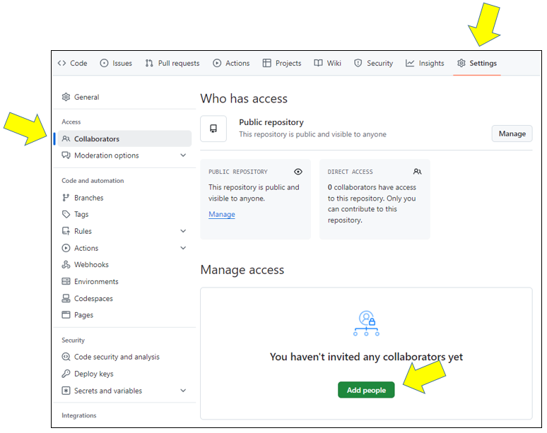
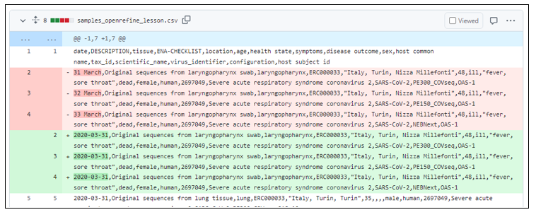

> ### About this episode
> In this session we will work in pairs/small groups to learn how to work in a collaborative manner in repositories which belong to a group that you are part of.
> We will do this through a change proposal (pull request) and review and also discuss the pros and cons with different strategies.
{: .callout}

## Step 1: Learn how to add collaborators to your repository

In the previous episodes we have learned how to work with our own local and remote repositories. The first step to allow changes by others is to add your group members or collaborators as "collaborators" under GitHub. By default this allows them to change things directly (this can be prevented by altering the settings of your repository).

- Navigate to your repository `analysis-recipe`.
- Click on "Settings" (top right), then "Collaborators" (left), then "Add people" (green button).
- Add the collaborator's GitHub username (shared on a post-it).

From here on the collaborators can push changes in the same way as we have done in a
single-person repository in the previous episodes.

> ## Discussion
>
> What are some advantages and possible disadvantages of this setup?
>
>> ## Answer
>> Advantages:
>> - Time efficient to let all collaborators work independently from others
>> - 
>> Disadvantages:
>> - The risk of introducing errors increase when allowing collaborators to work on the main branch
>> - 
>{: .solution}
{: .challenge}

<!-- TO DO: Provide more examples to the discussion -->

## Step 2: Submit a small change via the web interface as collaborator

As a collaborator, it is possible to make changes on the `main` branch directly. However, in this exercise we will learn a better way by submitting a "pull request" (a **change proposal**) towards the `main` branch for **review**. We will practice this by suggesting a change in a data file:

- Navigate to the repository of your collaborator by entering the following in your browser: "https://github.com/`username_of_collaborator`/analysis-recipe" (you need to change the username_of_collaborator to the one shared with you on the post-it)
- Once in the correct repository, click on the file `samples_openrefine_lesson.csv` 
- Open the file editor via web (click on the edit pen)
- Modify or extend one or a few rows in the data file, for example: in row 2-4 change the dates to "2020-03-31"
- Click on `commit changes` and write a suitable commit message 
- Instead of choosing "Commit directly to main branch" choose `"Create a new branch for this commit and start a pull request."` 
- Enter a meaningful branch name (it can be useful to prefix it with your name so that we know who this branch belongs to), e.g.: `YvonneKallberg-date-fix`

- After we click "Propose changes" we are taken to this form:

- Verify the **source and target branch**, that the source is the branch where you have made your commits to and that the base branch is the target where you want your changes to be integrated. 
- If desired: edit the **title** and **description** of the "pull request" (change proposal)
- Click "Create pull request"

## Step 3: Review the pull request
Once the "pull request" is submitted, it can be reviewed by a repository member:
- Click on `Pull requests` in the top menu, and then click on the name of the branch (e.g. "YvonneKallberg-date-fix")
- Review changes by clicking on the `Files changed` tab and check that your agree on the changes made 
  
- Write comments
- Approve 
We can discuss and ask for changes before merging the changes "Merge pull request"
<!-- there are no instruction on review, could that be some extra material at least? -->

> ## Tips
>
> - Ideally submitter and reviewer should be two different persons.
> - You can modify an open "pull request" by committing new changes to the branch
> - Review is not only to assure quality but also to enhance learning and **knowledge transfer** within the group
> - Protecting the `main` branch "forces" all changes to it to be reviewed first.
>   **We recommend this for group repositories**. To read more see: [GitHub Documentation about protecting branches](https://docs.github.com/en/repositories/configuring-branches-and-merges-in-your-repository/managing-protected-branches/about-protected-branches#about-branch-protection-rules)
{: .callout}

## Step 4: Resolving a conflict

### Demo: let us experience a conflict

**When merging** two branches a conflict can arise when the same file **portion**
has been modified in two **different** ways on the two branches.

We can demonstrate how a conflict looks and how to resolve it:
- Imagine that two collaborators have created "pull requests" (change proposals)
  branching from `main` changing the same line in two different ways

- We merge together one of the pull requests (this will work)
- Then we try to merge the other and we see a conflict:

- We will try to resolve the conflict via the web browser.
- Choose the version that you wish to keep, by removing the rows to be discarded as well as conflict markers, click on **Mark as resolved** and then on **Commit the merge**

> ## Discussion
>
> - Compare with Google Docs: can you get conflicts there? What are the advantages and disadvantages?
> - What can we do to avoid conflicts?
{: .discussion}

## Extra Exercise: Submit a small change via the web interface as external contributor *Optional 

Submitting a change proposal as external contributor (we assume you are not added
as "collaborator" and thus have no write-permissions to a repository) will prompt you to make a **fork** of the repository (GitHub makes a copy of the original repository to your user space) and then 
you can submit a "pull request" in a similar way as before. Only this time you have no other choice than “Propose file change”.

<!--add screenshot-->

- Navigate to the repository of your instructor by entering the following in your browser : "https://github.com/`username_of_instructor`/analysis-recipe" (you need to change the username_of_collaborator to the one written in the whiteboard)
- Once in the correct repository, click on the file `samples_openrefine_lesson.csv` 
- Open the file editor via web (click on the edit pen)
- Modify or extend one or a few rows in the data file, for example: in row 14 change the date to "2020-03-31"
- Click on `commit changes` and enter a meaningful commit message
- Click "Propose changes"

 <!-- change image-->

- After we click "Propose changes" we are taken to a pull request form:
 <!-- change image-->

- This time, in addition to the **source and target branch**, there are also **source and target repositories** that we need to verify
- You can now review the change before submitting it via the green button "Create pull request"
- if desired: edit the **title** and **description** of the "pull request"
- Click "Create pull request"
- The fork can be removed later if desired.

<!-- Summary needs review/refresh -->
> ## Summary
>
> - In this episode we learned how to propose changes and submit changes via "pull requests".
> - Protecting the `main` branch and insisting on every change going
>   through a pull request can be useful to get feedback on your changes
>   and to improve knowledge transfer.
> - For controversial changes it can
>   be useful to first discuss in an issue before submitting the changes.
> - Note that you can mark pull requests as draft to collect feedback on unfinished work.
{: .callout}